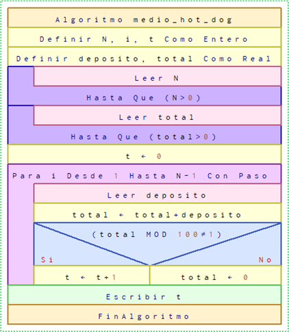

# 13.El medio hot-dog 

#### Dificultad: Intermedio

## Descripcion

*Vicente es un informático muy importante con una cuenta bancaria muy importante. Dado que Vicente es tan exitoso con muchos clientes, deposita dinero en su cuenta cada mañana. Después de ir al banco y depositar dinero, Vicente va a teletrabajar. Y ahí reside la gran debilidad de Vicente: una tienda de hot-dog . Vicente es un adicto a los hot-dog que se recupera, y aunque no ha comido un hot-dog en años, no puede dejar de preguntarse cuántos hot-dog de USD \$1.00 podría comprar con el dinero de cuenta. Tener USD \$5.00 en su cuenta significa 5 hot-dog que Neil podría tener, pero ¿qué hay de USD \$4.50? Bueno, eso es más de 4 hot-dog por supuesto, pero definitivamente menos de 5. ¿Cómo compraría uno incluso una cantidad no entera de hot-dog?*

*Ese concepto confunde a Vicente, así que cada vez que su saldo de cuenta no es un número entero, se detiene para reflexionar sobre la naturaleza de los hot dogs no enteros y termina siendo tarde para trabajar. Ahora, Vicente ha llegado demasiado tarde muchas veces y está empezando a preocuparse de que perderá su trabajo. Él quiere saber cuántas veces llegará tarde a trabajar durante los próximos días, dado su saldo inicial en la cuenta y la cantidad de dinero que depositará cada día. Por favor, responda esto por él, o Vicente empezará a pensar de nuevo.*

**Entrada**

La primera línea contiene un número entero N (1 ≤ N ≤ 1000), el número de días de análisis. Cada una de las siguientes líneas N+1 contiene una cadena que representa una cantidad de dinero. La primera cadena es el saldo inicial de la cuenta de Vicente, mientras que las siguientes cadena N son las cantidades que depositará en su cuenta en los diferentes días. Cada cadena tiene la forma \$X.Y donde X es una subcadena de longitud 1 ó 2 indicando el dinero entero en la cantidad \$X.Y, mientras que Y es un subcadena de la longitud exactamente 2 que denota los centavos en la suma \$X.Y


| Entrada (USD \$)                         | Salida   |
|------------------------------------------|----------|
| \$1, \$1.57, \$3.14                      | 1        |
| \$4, \$1.00, \$0.01, \$0.99, \$10.00, \$98.76 | 2        |

**Salida**

Hot-dog: Alimento que se genera con la combinación de una salchicha del tipo Frankfurt (frankfurter) o vienesa (wiener) 
hervida o frita, servida en un pan con forma alargada que suele acompañarse con algún aderezo, como salsa de tomate, mostaza,
entre otros. Denominado completo en Chile, pancho en Argentina y perro caliente en México (dato inútil).


# ADCP

## (A)nalisis

###### Entradas: 
Entero **N** y **N+1** reales de la forma \$**X.Y** 

###### Proceso:
La clave del problema está en detectar en qué momento Neil entra en modo reflexión, esto es cuando la suma de su cuenta más el dinero depositado da un número real y no entero. Dicho de otro modo, Vicente llegará tarde al detectar parte decimal distinto de cero de su cuenta distinta de cero. Se asume que cuando tiene un saldo $S de dinero se compra S hot-dog (si ésto no ocurre no importaría, ya que se restaría una cantidad entera de dinero).

###### Salida: : 
Veces en que llegará tarde (t)

###### Restricciones: 
N>0, \$X.Y>0

# (D)iseño 

## En Diagrama N-S



# (C)odificación en C
```c
#include <stdio.h>
#include <stdlib.h>

int main(){
    int N, i, t = 0;
    float deposito, total;

    do{
        scanf("%d", &N);
    } while (N <= 0);

    do{
        scanf("%f", &total);
    } while (total <= 0);
    
    for (i = 0; i < N; i++){
        scanf("%f", &deposito);
        total += deposito;

        if ((int)total / total != 1)
            t++;
        else
            total = 0;
    }
    
    printf("%d", t);

    return EXIT_SUCCESS;
}
```
# (C)odificación en Python
```py
N = int(input())

total = int(input().split(".")[1])

t = 0

for i in range(N):
    deposito = int(input().split(".")[1])
    total += deposito
    
    if total % 100 == 0:
        total=0
    else:
        t += 1

print(t)
```
# (P)ruebas

      | Entrada (USD $)                         | Salida   |
      
      |-----------------------------------------|----------|

      | 1                                       |  1       | 
      | 1.57                                    |          |
      | 3.14                                    |          |
      
      | 4                                       |  2       |
      | 1.00                                    |          |
      | 0.01                                    |          |
      | 0.99                                    |          |
      | 10.00                                   |          |
      | 98.76                                   |          |
