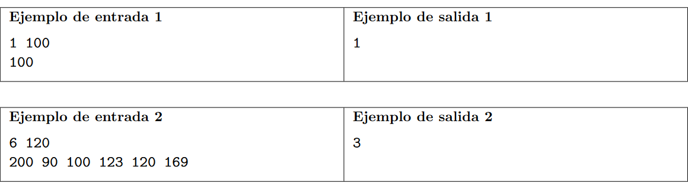

# Origen 
https://codeforces.com/gym/104555/problem/A
# Ejercicio

#### Dificultad: facil 

## Descripción

Conoce a Carlitos, un entusiasta aventurero con un insaciable amor por los parques de diversiones. A pesar de su vibrante pasion, Carlitos enfrenta un reto unico su estatura. Cuando planea entusiasmado su escapada de fin de semana, se da cuenta que sus limitaciones verticales podrian provocar problemas en su experiencia de parques de diversiones. No es solo escoger un parque; es tambien encontrar uno donde pueda disfrutar la emocion de los juegos.
Imagina el caleidoscopio de colores, la risa jubilosa, y los latidos del corazon durante los juegos. Carlitos siempre ha sido atraido por la energia de los parques de diversiones. Con el fin de semana aproximandose, el analiza detenidamente folletos de parques, estudiando los requerimientos de estatura de cada juego. Su objetivo es maximizar su diversion, y aqui es donde entras tu.
Tu tarea es ayudar a Carlitos a determinar el numero de juegos que el puede disfrutar en un parque especifico. Considerando su estatura y la estatura minima requerida en cada juego, guialo para conseguir la mayor cantidad de diversion en su aventura en el parque.

**Entrada.**
La primera linea contiene dos enteros, N y H (1 ≤ N ≤ 6 y 90 ≤ H ≤ 200), representando el numero de juegos en un parque y la estatura de Carlitos en centimetros, respectivamente.
La segunda linea contiene la minima estatura requerida A1, . . . , AN (90 ≤ Ai ≤ 200) de cada juego en el parque.

**Salida.**
Imprime una unica linea con un entero indicando el numero de juegos a los que Carlitos puede
subir, esto es, el numero de juegos para los cuales la estatura de Carlitos es al menos igual a la estatura
minima requerida.



# ADCP

## (A)nálisis

###### entradas

recibimos dos enteros positivos  N y H 
luego recibimos N enteros positivos 

###### restricciones 

N no superara los 6 elementos 
H no sera mayor a 200
cada elemento An estara entre 90 y 200 

###### proceso
viendo este ejercicio podriamos simplemente evaluar caso a caso la altura de cada juego y revisar si cumplimos la condicion de que carlitos tiene que ser mas alto que la altura que pide por lo que podemos asumir que carlitos mide 160 cm y realizar el siguiente plantemiento


##### salida 

de esta forma la salida solo seria el numero de juegos que a los que puede subirse

## (D)iseño

```
> comparar uno a uno los tamaños de los juegos
> entregar el resultado 
```


## (C)odificación

```py
N,H = [int(i) for i in input().split(" ")] #por la forma en la que trabaja python tomamos de todas formas ambos datos
alturas = input().split(" ") #pero tomamos todas los siguientes casos y simplemente los separamos para hacerlos arreglos
resp = 0
for i in alturas: #luego recorremos 
    if H > int(i): #y verificamos el tamaño 
        resp+=1

print(resp)
```
## (P)ruebas 
