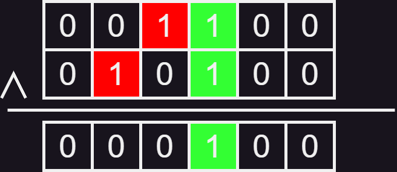
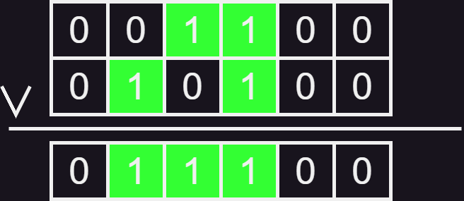

# Origen 
[origen](https://vjudge.net/problem/UVA-11933)

traducido por Vicente Bastidas  
# Ejercicio 7

#### dificultad: dificil 

## Descripición 

definimos la operacion de dividir un numero binario N en dos numeros **a** y **b** es de la siguiente forma. Definimos 0<= i1 <= i2 < ... < ik como el indice de los bits partiendo por el primer indice que sea 1. los indices que perteneceran a **a** seran de la forma i1,i3,... y los indices que perteneceran a **b** seran i2,i4,...
por ejemplo si N es 437 en binario quedaria como 110110101, entonces los resultados serian **a** = 010010001 = 145 y **b** = 100100100 = 292.

Input
cada caso de prueba consiste en un solo entero n entre 1 y (2^31)-1 
en forma decimal (base 10) un solo numero por linea. 
los inputs se terminan cuando una linea contenga un 0 el cual no debe ser procesado.

Output
la salida de cada caso de prueba consiste en una linea que contiene los numeros **a** y **b** en su version decimal separados solo por un espacio.

|Casos de prueba|Salidas de prueba|
|---------------|-----------------|
|       6       |    2 ,    4     |
|       7       |    5  ,   2     |
|       13      |    9   ,  4     |
|       0       |                 |  


# ADCP

## (A)nálisis

###### entradas

enteros simples positivos menores a 2^31-1 hasta que alguno sea 0 en cuyo caso se detendra el programa
###### restricciones 

ninguna mas haya de que N sea positivo y menos a 2^31-1

###### proceso

este ejercicio puede parecer complejo e inabarcable pero en la realidad es mas simple de lo que parece. Todo lo que necesitamos es una cosa llamada mascara de bits y operaciones a nivel de bits que son respectivamente una operacion simple y una aplicacion de dicha operacion, pero como esto podria servir mas adelante viene bien una pequeña explicacion.

las operaciones a nivel de bits son un tipo de operacion muy simple para el computador que trabaja usando la forma en la que se escriben los numeros en binario o sea dependiendo de la operacion y de si existe un 1 o un 0  en una misma posicion dara un resultado u otro, de esta forma nosotros usaremos 2 operaciones especificas, **and** y **or**

**operacion and**
esta es la operacion que usaremos para nuestro ejercicio, la operacion and revisa si en un mismo sitio en dos numeros tenemos unos, en cualquier otro caso dara un cero, usando de ejemplo el siguiente numero 001101 y 010100 nos daria como resultado 000100 como podemos ver aqui abajo.

Esto es porque donde esta ese 1 es el unico que coincide en ambos casos, si ubieran dos 0 no pasa nada porque no es informacion importante  

**operacion or**
esta operacion es similar al AND pero es mas simplemente, si encuentra un 1 en cualquiera de los dos numeros dara un 1 como resultado 1 de otra forma habra un 0, si usamos los mismos numeros de ejemplo ahora nos daria 011100 porque en los tres casos existe algun 1.



por ultimo caso, una aplicacion puede ser la mascara de bits, la mascara de bits se aprovecha del resultado de una operacion AND para filtrar informacion especifica, supongamos que un numero muy grande guarda en sus primeros 3 ultimos bits un color, con esa tecnica uno podria extraer especificamente el color rapidamente sin mayores problemas. 

Ahora con toda esta chachara dicha podemos ir directamente al ejercicio el cual es muy simple una vez tienes todo este contexto. 

lo primero que queremos hacer es saber que tan grande es el numero, esto lo podemos hacer de distintas formas dependiendo del lenguaje que usemos, una vez tenemos el tamaño podemos simplemente ir viendo numero a numero si el equivalente binario es distinto de 0, si lo es lo metemos en una de la dos respuestas y estas las podemos simplemente intercalar con un bool y un if, una vez hecho esto tenemos nuestro resultado

##### salida 

dos enteros a y b, como detalle importante estos dos numeros siempre sumaran el valor N 

## (D)iseño

## (C)odificación
```py
#other = int(other,2)
n = int(input()) #definimos primero el numero que usaremos para nuestro ejercicio
while(n != 0):
    a = 0 #luego definimos las variables para la respuesta 
    b = 0
    bi = format(int(n),'b')
    paso = True
    for i in range(len(bi)): #esta forma si bien parece engorrosa es una forma simple de separar valores binarios
      if (n & (1<<i)) != 0: #con esto verificamos si el valor es 0 o distinto de 0 
            if paso: #en este if iremos intercalando hacia donde va cada 1 y su valor en decimal se ira sumando a la respuesta
                a+=(n&(1<<i))
            else:
                b+=(n&(1<<i))
            paso = not paso #con esto finalmente hacemos que se intercalen a y b

    print(str(a) +" " + str(b))
    n = int(input())
```
## (P)ruebas 
entradas
437
13
256
2973678
0

salidas
145 292
256 0
9 4
595274 2378404
