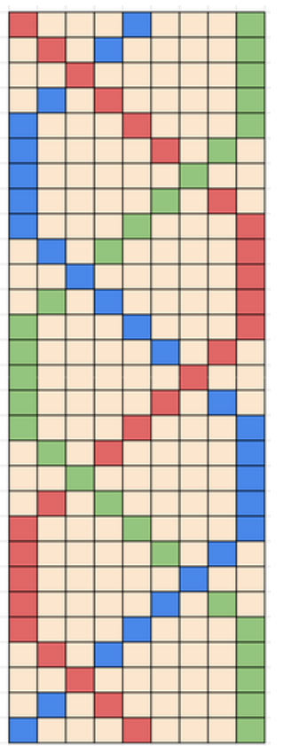
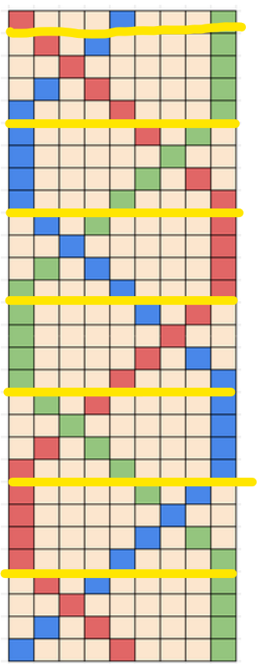

# origen 
[origen](https://codeforces.com/gym/104146/problem/B)

traduci
# ejercicio

#### dificultad: facil 

## descripicion 
Alicia ama las trenzas,  las ama tanto que todos los que la conocen solo la han visto con algun tipo de trenza.

Un dia Pepito le pregunto a Alicia si podria enseñarle como hacer una trenza simple, Alicia emocionada le dio la siguiente instruccion.
- separa el pelo en 3 secciones 
- por **n** veces, toma dos secciones adyacentes y cruzalas una tras la otra
  - alternamos entre cruzar izquierda sobre centro (left-over-middle) y derecha sobre centro (right-over-middle)
  - la cruza inicial la decides tu

Pepito no entendio esa explicacion tan simple asi que Alicia creo la siguiente imagen para con algo de suerte, ayudarle a entender con mas claridad, Aca ahi un ejemplo de una trenza de largo **n=7** cruza que empieza con izquierda sobre centro(left-over-middle)



¡ahora con ayuda de esa imagen Pepito lo entiende! y le da las gracias a Alicia por la util imagen.
Alicia piensa que esa imagen ah sido tan util que deberia hacer mas. Dado el numero de cruzas **n**, la direccion de la primera cruza y un string **s** que representa el color que deberia ser, con todos esos elementos imprime un dibujo similar es ASCII, mira el formato de impresion en la seccion de output
# ADCP

## (A)nalisis

###### entradas
un entero positivo.
dos  lineas de texto 
###### restricciones 
la primera linea de tiempo tiene que decir o right-over-middle o left-over-middle
la segunda linea debe tener si o si 3 caracteres
###### proceso
este ejercicio puede verse complicado porque requiere que hagamos un dibujo, pero en estos casos es bueno tomar el ejercicio y separarlo en partes pequeñas las cuales ir analizando una a una asi que vayamos por ahi. 

si vemos el ejrcicio en la seccion de salida nos dice que que el rectangulo a imprimir tiene 1+4n columnas, podemos notar que la n es la cantidad de trenzas que tiene, lo que nos indica que siempre va a ver 1 primera linea con los colores en su posicion original y y si probaramos con una sola trenza como con el primer caso de ejemplo que pone, tendriamos 4 columnas las cuales tienen una forma muy especifica como podriamos ver en esta separacion de la imagen de muestra 



si miras a cualquier separacion y a mano le das vuelta puedes ver que es la misma imagen, con esto ya sabemos que siempre imprimiremos el mismo patron, yendo a una sentido u otro dependiendo de como empiece y aunque no lo parezca ya tenemos casi la mitad del ejercicio listo, al menos la parte de como hacer el trenzado, ahora solo tenemos que tener en consideracion que el texto que tenga en principio sera lo que defina en que sentido se creara la trenza para luego repetirlo en un loop

##### salida 
un  diseño que muestra como las lineas de las trenzas se van entrelazando de largo 1+n*4 


## (D)iseño

basicamente mostrar los dos puntos posibles, haciendo una trenza hacia la izquierda y otra a la derecha, luego en funcion de en que sentido empiece podemos ir comparando modulos de un numero hasta N dividido por 2 de esa forma, se ira intercalando solo

(dos flechas apuntando a ambas imagenes, luego un diagrama de flujo con el siguiente orden )

es "right-over-middle" --> por N repeticiones preguntar: (es ni%2 = 0 ) si lo es imprime hacia la derecha, si no imprime hacia la izquierda


## (C)odificacion

```py
n = int(input())
order = input()
custom = input()

def LoM(aux):
    print("."+(aux[0])+"."+(aux[1])+"...."+(aux[2]))
    print(".."+(aux[0])+"....."+(aux[2]))
    print("."+(aux[1])+"."+(aux[0])+"...."+(aux[2]))
    print((aux[1])+"..."+(aux[0])+"..."+(aux[2]))
    aux = aux[1] + aux[0] + aux[2]

def RoM(aux):
    print(aux[0]+"...."+(aux[1])+"."+(aux[2])+".")
    print(aux[0]+"....."+(aux[2])+"..")
    print(aux[0]+"...."+(aux[2])+"."+(aux[1])+".")
    print(aux[0]+"..."+(aux[2])+"..."+(aux[1]))

    aux = aux[0] + aux[2] + aux[1]


print(custom[0] + "..."+ custom[1] + "..." + custom[2])
if order == "right-over-middle":
    for i in range(n): #parte hacia la derecha
        if i%2 == 0:
            RoM(custom)
        else:
            LoM(custom)
elif order == "left-over-middle":
    for i in range(n): #parte hacia la izquierda
        if i%2 == 0:
            LoM(custom)
        else:
            RoM(custom)
else:
    print("wrong words")
    

```


## (P)ruebas 