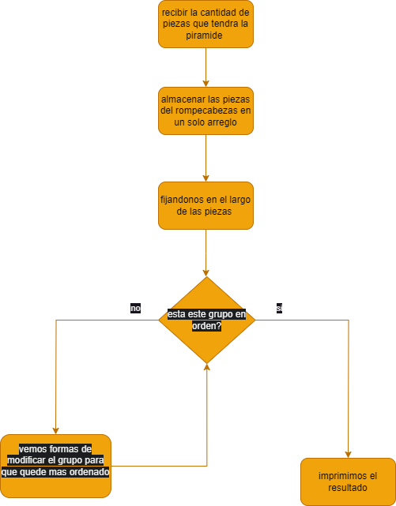

# fuente 
    reinterpretado a partir de ejercicios similares en el ramo de programacion 2 
    reescrito por vicente bastidas.
# ejercicio

#### dificultad: media 

## descripición 

En un pequeño pueblo rodeado de colinas verdes y ríos cristalinos, vivía Mateo, un joven apasionado por resolver acertijos y retos de lógica. Desde pequeño, Mateo soñaba con convertirse en un programador competitivo reconocido a nivel mundial. Pasaba sus días entre las páginas de libros de algoritmos y prácticas intensas en su computadora.

Un día, mientras paseaba por el mercado local, escuchó a un grupo de viajeros contar historias sobre un antiguo desafío maya que se rumoreaba imposible de resolver. Mateo, intrigado y emocionado por el desafío, decidió investigar más. Descubrió que el desafío consistía recoger piezas de diversos tamaños e irlas ordenando hasta formar una piramide, lo que hace tan dificil este ejercicio es que cada vez que alguien intenta hacerlo la cantidad de las piezas cambia.

Con su determinación encendida, Mateo se encerró en su habitación con su computadora y comenzó a escribir código. 
Tras varias horas sin llegar a un resultado convincente decidio pedirte ayuda con el codigo, para poder resolver este acertijo, ¿seras capaz de resolverlo?. 


---

# ADCP

## (A)nalisis
###### entradas
un entero N 
N arreglos de tamaños variados 

###### proceso

este ejercicio solo busca que uno sepa ordenar listas, esto se puede hacer de dos formas, sabiendo usar la funcion sort o aplicando manualmente un algoritmo de busqueda.

si sabemos ocupar sort, simplemente tenemos que modificarlo para que ordene en base al largo del arreglo.

ahora si se quiere realizar de forma manual lo que se puede es ocupar un _algoritmo de ordenamiento_ el cual es una forma de ordenar informacion en este caso informacion ascendente. 

para usar un ejemplo ocupare el caso de _bubble sort_, este algoritmo lo que hara es ir revisando elemento a elemento viendo quien es mayor y si el primer elemento es mayor cambian de posicion, esto lo hacen hasta que la lista este completamente ordenada. 

*ejemplo*

*entrada*
6
a z 
a z t e c a
a z t 
a z t e c 
a 
a z t e 

*salida*
a z 
a z t 
a z t e 
a z t e c 
a z t e c a

| entrada | salida | 
|  ---  | ---  |
| 6       | a |
|a z |a z |
|a z t e c a|a z t |
|a z t |a z t e |
|a z t e c |a z t e c |
|a |a z t e c a|
|a z t e | |


##### salida 
N arreglos de tamaños variados ordenados por tamaño
###### restricciones 
N debe ser positivo
## (D)iseño




## (C)odificación

```py

def orden(a):
    return len(a)

n = int(input()) #tamaño de la piramide 
piramide = []; # un arreglo donde meteremos todos los segmentos de la piramide como lleguen 

for i in range(n): #recibimos las piezas y las separamos en torno a los espacios, esto para saber que tamaño tiene cada pieza
    piramide.append(input().split(" "));

piramide.sort(key=orden)  #ordena todo de forma ascendente, la funcion orden le indica que lo haga en torno al tamaño del arreglo de la piramide

#imprime el resultado final
for i in range(n):
    print(piramide[i])


```


## (P)ruebas 


| entrada | salida | 
|  ---  | ---  |
| 6       | a |
|a z |a z |
|a z t e c a|a z t |
|a z t |a z t e |
|a z t e c |a z t e c |
|a |a z t e c a|
|a z t e | |

4
c a 
c a s a
c 
c a s

|entrada|salida| 
|---|---|
|4 |c|
|c a |c a|
|c a s a |c a s |
|c  |c a s a|
|c a s| |
