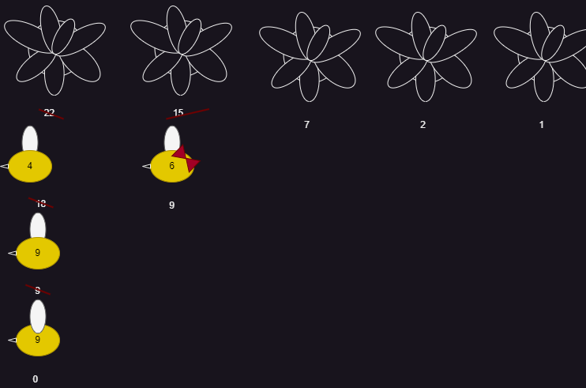

# origen 
[origen ](https://codeforces.com/gym/104555/problem/E)
# ejercicio

#### dificultad: medio 

## descripicion 

Ha llegado la primavera, marcando el comienzo de otra intensa temporada de trabajo en la Sociedad de las abejas de Chapeco (SaC). En el jardin de la SaC, han florecido N hermosas flores, cada una con una cierta cantidad de granos de polen que seran recolectados por las laboriosas trabajadoras de la sociedad. Para mantener un entorno de trabajo seguro, la SaC tiene reglas muy estrictas para la recoleccion de polen, que son las siguientes:

• Cuando una abeja visita una flor, debe recolectar una cantidad de polen igual a la suma de los digitos del total de polen actual en esa flor. Por ejemplo, si una flor tiene 123 granos de polen, la abeja que la visita debe recolectar 1 + 2 + 3 = 6 granos, dejando la flor con 123 − 6 = 117 granos. Si la flor tiene 201 granos, la abeja recolectara 2 + 0 + 1 = 3 granos, dejando la flor con 201 − 3 = 198 granos de polen.

• Todas las abejas deben formar una fila al comienzo del dia; aquella que este en la primera posicion de la fila debe recolectar polen de alguna de las flores que tienen la mayor cantidad de polen.
Si la abeja visita una flor con 0 granos, recolecta cero granos de polen. Despues de recolectar el polen de una flor, la abeja termina su turno de trabajo y regresa a la colmena.
A la abeja Gertrude estas reglas le parecen muy extrañas, asi que busco tu ayuda para saber cuanto polen recolectara en su turno. Gertrude tiene una vista increible y descubrio que actualmente esta en
la K-esima posicion de la fila.

# ADCP
## (A)nalisis

###### entradas
dos enteros N y K, enteros positivos 
N numeros positivos 

###### restricciones 
N es un entero positivo 
K es un entero positivo menos o igual a N
N numeros positivos menores a 999


###### proceso

para este ejercicio podemos simplemente simular el proceso de seleccion de las N flores hasta llegar a gertrudis, o sea que en N flores realizamos el proceso K veces usando la entrada de prueba



con gertrude siendo nuestra abeja que nos interesa podemos ver que la polen que ella llevara seran 6 unidades de polen

##### salida 

un entero Q 

## (D)iseño


## (C)odificacion

```py
N,K = [int(i) for i in input().split(" ")] 
flores = input().split(" ")

for i in range(K): # con esta funcion haremos avanzar a todas las 
    recolecta = 0
    for j in flores[0]: #esto separa el numero en sus elementos independientes
        recolecta += int(j) #recolectamos el polen 
    flores[0] = str(int(flores[0]) - recolecta) #y lo quitamos del polen total de la flor
    if flores[0] == '0': #si la flor se quedara vacia la eliminamos de lista de flores
        flores.remove('0')  
    

#finalmente llegamos al turno de gertrude asi que replicamos el proceso una ultima vez y lo imprimimos    
recolecta = 0
for j in flores[0]:
    recolecta += int(j)
print(recolecta)
```


## (P)ruebas 