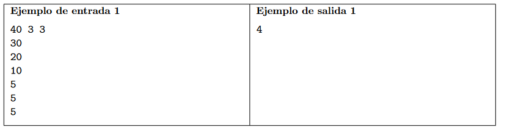

# fuente 
[origen](https://codeforces.com/gym/104555/problem/F)
# ejercicio

#### dificultad: fácil 

## descripición 

William esta planeando sus proximas vacaciones. Un problema recurrente en todas sus vacaciones es la necesidad de lidiar con el cansancio. Algunos dias no los disfruta mucho, pues despues de varias actividades el cansancio comienza a ser mayor de lo que puede soportar.

En esta ocasion, William tuvo una idea. Va a estimar el impacto que tiene en su disposicion cada una de las actividades de turismo que puede realizar. El not´o que algunas de las actividades de las vacaciones, como deportes y caminatas, son agotantes, comsumiendo su disposicion, mientras que otras actividades como las obras de teatro y musicales, son revitalizantes, recuperando su disposicion.

Mas precisamente, William comienza con D unidades de disposicion y separa las actividades en dos grupos: C actividades agotantes, y R actividades revitalizantes. Cada actividad agotante requiere una cierta cantidad de disposicion, y por lo tanto, consume esa cantidad cuando es realizada. Cada actividad revitalizante le proporciona una cierta cantidad de disposicion cuando es realizada. Ademas, ordena las actividades de cada grupo segun un orden de preferencia, pues hay actividades que esta mas ansioso por realizar. Es importante mencionar que las actividades de los dos grupos pueden ser intercaladas, pero William nunca realizara una actividad de un grupo sin haber realizado todas las actividades anteriores, pues esto iria en contra de sus preferencias.
A lo largo de sus vacaciones, al decidir que actividad realizar en seguida, el elegira la primera actividad agotante que aun no haya realizado, si es que tiene suficiente disposicion para hacerlo. En caso contrario, llevara a cabo la siguiente actividad revitalizante que aun no haya realizado, si es que aun hay alguna, recuperando asi cierta cantidad de disposicion. Naturalmente, si en algun momento ya no quedan actividades agotantes por realizar, simplemente podra llevar a cabo todas las actividades revitalizantes restantes. Teniendo en cuenta este proceso, William ha pedido tu ayuda para determinar cuantas actividades (incluyendo tanto agotantes como revitalizantes) puede llevar a cabo.

**Entrada**
La primera linea de entrada contiene tres enteros: D, C, y R. Representando respectivamente, la cantidad de disposicion inicial, el numero de actividades agotantes, y el numero de actividades revitalizantes (1 ≤ D ≤ 105, 1 ≤ C ≤ 104, y 1 ≤ R ≤ 104). Cada una de las siguientes C lineas contiene un entero Ci (1 ≤ Ci ≤ 105 para 1 ≤ i ≤ C), representando el consumo de disposicion de una actividad agotante, en orden de preferencia. Finalmente, cada una de las siguientes R lineas contiene un entero Ri (1 ≤ Ri ≤ 105 para 1 ≤ i ≤ R), representando el retorno de disposicion de una actividad revitalizante, en orden de preferencia.

**Salida**
Imprima una unica linea que contenga un unico entero, el numero total de actividades (incluyendo tanto agotantes como revitalizantes) que William puede llevar a cabo.



# ADCP

## (A)nalisis

###### entradas


###### proceso

este caso el propio ejercicio nos dice una forma de solucionar el problema, realizar actividades agotadoras hasta que sea necesario hacer actividades relajantes, por lo que solo necesitamos alguna maquina sensilla que revise la cantidad, igual cabe destacar que tenemos que tener un caso para cuando no queden activiades agotadoras realizar todas las actividades relajantes.

##### salida 

un solo numero entero con la cantidad de actividades que puede realizar 

###### restricciones 
no presenta mayores restricciones

## (D)iseño


## (C)odificación
 ```py

D,C,R = [int(i) for i in input().split(" ")] #recibimos los datos
ago = [] #lista de actividades que agotan a william
rev = [] #lista de actividades que relajan a william
cant = 0 # la respuesta que buscamos 

for i in range(C): #guardamos las actividades en sus dos grupos
    ago.append(int(input()))

for i in range(R):
    rev.append(int(input()))

while(D>0 ): #esto pregunta escencialmente si nos queda energia para realizar alguna actividad
    print(str(D) + " " + str(ago) + " "+ str(rev))
    if ago: # vemos si queda alguna actividad agotante, de esta forma revisara automaticamente el tamaño, si no queda nada sera falso
        if(D>=ago[0]):
            cant+=1
            D-=ago[0]
            ago.pop(0)
        elif rev: #revisamos si podemos recuperar energia haciendo activides que relajen
            cant+=1
            D+=rev[0]
            rev.pop    
            pass
    elif rev: # si no quedan actividades agotantes, revisa si quedan actividades relajantes
        cant+=1
        rev.pop(0)
    else: # si no quedan actividades agotantes y relajantes terminamos el bucle
        break

print(cant)

```
## (P)ruebas 
entrada 
40 3 3
30
20
10
5
5
5

salida 
4 

