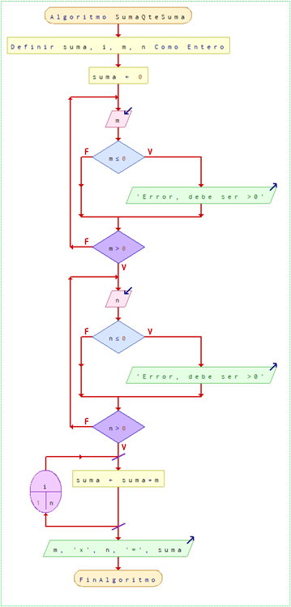

# 1.SumaQtesuma

#### Dificultad: fácil

## Descripcion

*A un estudiante de 1° básico se le dio como desafío calcular el producto de 2 números no negativos distintos de 0, a pesar de que el estudiante sólo sabe hacer sumas simples. Ayúdale a entender la multiplicación y resolver el problema a partir de lo que sabe.* 

 ______________________________________
|    Entrada    |	 Salida            | 
|______________________________________|
|   2 8	    |      16              | 
|______________________________________| 
|   5 11     |      55              |     
|______________________________________|
|   0    12     | Error, debe ser >0   |    
|______________________________________|
|  144    0     | Error, debe ser >0   |     
|______________________________________|
|  -1     5     | Error, debe ser >0   | 
|______________________________________|


# ADCP

## (A)nalisis

###### Entradas: 
Un número (n)

###### Proceso:
Proceso mental: Recuerden que en este apartado ustedes pueden incluir una oda, una fórmula, un mapa conceptual, un esquema, un gráfico, una secuencia numérica, un diagrama de eventos...un dibujo. Todo aquello que se relacione con sus experiencias de aprendizajes previas y que le ayude a entender el problema y a proponer una solución. Como el problema menciona a un estudiante de primero básico, que por currículum sólo sabe realizar sumas simples, debemos explicarle la operación multiplicación a través de la siguiente analogía: 

Consideremos casos
a=1, b=3, a*b=1*3= 1+1+1 3 veces
a=2, b=4, a*b=2*4= 2+2+2+2 4 veces
a=5, b=10, a*b=5*10=5+5+5+… 10 veces
Generalizando m*n = m+ m+ …+ n veces

###### Salida:
m*n

###### Restricciones:
m >0, n >0 (no negativos ≠ 0)

# (D)iseño


# (C)odificación
```c
#include <stdio.h>
#include <stdlib.h>

int main(){
    int suma, i, n, m;
    suma = 0;

    do{
        printf("Ingrese un numero mayor a 0\n");
        scanf("%i", &m);
        if (m <= 0){
            printf("Error, debe ser >0\n");
        }   
    } while (m <= 0);

    do{
        printf("Ingrese un numero mayor a 0\n");
        scanf("%i", &n);
        if (n <= 0){
            printf("Error, debe ser >0\n");
        }
    } while (n <= 0);  
     
    for (i = 0; i < n; i++){
        suma = suma + m;
    }

    printf("%i x %i = %i\n", m, n, suma);

    return EXIT_SUCCESS;
}
```
```py
def main():
    suma = 0
    
    while True:
        m = int(input("Ingrese un numero mayor a 0\n"))
        if m > 0:
                break
        else:
            print("Error, debe ser >0")
            
    while True:
        n = int(input("ingrese un numero mayor a 0\n"))
        if n > 0:
            break
        else:
            print("Error, debe ser >0 ")
            
    for i in range( 1, n + 1 ):
        suma = suma + m
    
    print(f"{m} x {n} = {suma}")
    
if __name__ == "__main__":
    main()
```

# (P)ruebas

 ______________________________________
|    Entrada    |	 Salida            | 
|______________________________________|
|   2    8	    |      16              | 
|______________________________________| 
|   5    11     |      55              |     
|______________________________________|
|   0    12     | Error, debe ser >0   |    
|______________________________________|
|  144    0     | Error, debe ser >0   |     
|______________________________________|
|  -1     5     | Error, debe ser >0   | 
|______________________________________|


