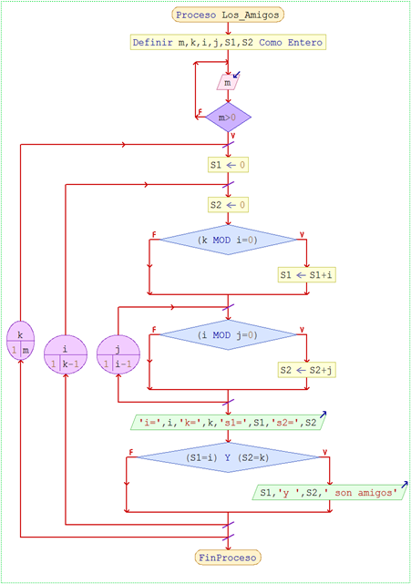

# 15:Amigos

#### Dificultad: fácil

## Descripcion

Dos números son amigos, si cada uno de ellos es igual a la suma de los divisores del otro (sin incluir al mismo número en la suma).
Por ejemplo, 220 y 284 son amigos, ya que:

Suma de divisores de 220:  1 + 2 + 4 + 5 + 10 + 11 + 20 + 22 + 44 + 55 + 110 = 284

Suma de divisores de 284:  1 + 2 + 4 + 71 + 142 = 220

Implemente un algoritmo que permita obtener las parejas de números amigos menores o iguales a m, siendo m un número ingresado por teclado. 


# Solución ADCP

# (A)NÁLISIS

###### Entradas: Cota superior (m)


###### Proceso mental:

    ¿Cómo se obtiene el divisor de un número?, si (K MOD  i = 0 )  con i=5, n  significa que k es divisible por 5
    ¿cómo se obtienen números amigos k, i? si suma divisores de k = suma divisores de i con k ≤ m e i<k
    
    Recuerde que: (a MOD b) es el resto de la división entera entre a y b, también conocido como operador módulo.
    
    Ahora bien, ¿cómo generar números entre 1 y m?

        Para k=1, m hacer //generará números de [1..m]
            
            Para i=1 hasta k-1 hacer //Generará números entre [1..k-1]
            Y aplicando la regla de divisores
    
        Si (k MOD i=0) Entonces
                    S1 <- S1+i; //acumulará a los divisores de k
                FinSi

###### Salida: números amigos (i,k)

###### Restricciones: m >0


## DISEÑO 

## En Diagrama N-S



# (C)odificación Py:
```py
    def main():
        i = 0
        j = 0
        k = 0
        
        m = int(input("Ingrese un entero positivo: "))
        while m <= 0 :
            if(m <= 0): print("Error! m debe ser >0 ")
            m= int(input("Ingrese un entero positivo: "))
            
        for k in range (1, m + 1):
            S1 = 0
            
            for i in range (1, k):
                S2 = 0
                
                if k % i == 0 :
                    S1 = S1 + i
                
                for j in range (1, i):
                    if i % j == 0:
                        S2 = S2 + j
                        
                print(f"\ni= {i} \tk={k} \tS1={S1} \tS2={S2}")
                
                if S1 == i and S2 == k:
                    print(f"Los numeros {i} y {k} son numeros amigos")
                
                
    if __name__ == "__main__":
        main()
```
# (C)odificación C:
```c
    
```
# (P)ruebas

    
    | m        | amigo 1                                                |   amigo 2                                             | 
    
    |----------|--------------------------------------------------------|-------------------------------------------------------|
    
    |   290    |	220                                                 |            284                                        |  
    
    |   1300   |    220, 1184                                           |           284, 1210                                   |  
    
    |   -1     |   ¡Error! m debe ser >0                                |        	                                            |  
    
    |   2950   |    220, 1184                                           |           284, 1210                                   |  
    
    |   1000   |220, 1184, 2620                                         |       284, 1210, 2924                                 |
    
    |   1000   |220, 1184, 2620, 5020, 6232, 10744, 12285, 17296, 63020,|284, 1210, 2924,5564, 6368, 10856, 14595,18416, 76084, |
    |          |66928, 67095, 69615, 71145, 76084, 79750, 87633, 88730  | 66992, 71145, 87633, 67095, 63020, 88730, 69615, 79750|  
    


