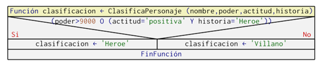

# 16.Problema Clasificación de personajes de anime 

#### Dificultad: fácil

## Descripcion
En un mundo lleno de anime, hay diferentes tipos de personajes con habilidades únicas. Los investigadores de la Academia de Ciencias de Anime están interesados en desarrollar un algoritmo de machine learning para clasificar automáticamente los personajes en dos categorías: "Héroe" o "Villano", basándose en sus características. C 
Se te ha asignado la tarea de desarrollar una solución que implemente un algoritmo de clasificación simple. Se proporciona un conjunto de datos de entrenamiento que contiene información sobre varios personajes de anime, incluyendo sus niveles de poder, su actitud, y su historia pasada. Considere los siguientes datos de entrenamiento (Nombre, Nivel de Poder, Actitud {1: Buena, -1: Mala}, Historia Pasada {0: Heroica, 1: Trágica})

Entradas

Naruto, 9000, 1, 0

Goku, 12000, 1, 0

Light, 5000, -1, 1

Freeza, 8000, -1, 1

Luffy, 7500, 1, 0

Sasuke, 8500, -1, 1

Vegeta, 11000, -1, 0

Reglas:

•	Si el nivel de poder es mayor a 9000, el personaje se considera un "Héroe".

•	Si la actitud es positiva (1) y la historia pasada es heroica (0), el personaje se considera un "Héroe".

•	En todos los demás casos, el personaje se considera un "Villano".

•	El algoritmo de clasificación debe implementarse en la función clasificarPersonaje (C y Python). 
    Los resultados se imprimen en la consola, indicando si cada personaje es un "Héroe" o un "Villano". 
    Los datos de entrenamiento deben ser inicializados durante la codificación del programa.
 


# Solución ADCP

# (A)NÁLISIS
###### Entradas: Datos de entrenamiento inicializados con la estructura (Nombre, Nivel de Poder, Actitud {1: Buena, -1: Mala}, Historia Pasada {0: Heroica, 1: Trágica}) 


###### Proceso mental: En el contexto de machine learning o aprendizaje de máquina, el algoritmo de clasificación utilizado en este problema es bastante simple y se basa en reglas condicionales. Ilustra el concepto de tomar decisiones automáticas basadas en características específicas.

        El algoritmo de clasificación sigue estas reglas:

    1.	Si el nivel de poder del personaje es mayor a 9000, se clasifica como "Héroe".
    
    2.	Si la actitud del personaje es positiva (1) y su historia pasada es heroica (0), también se clasifica como "Héroe".
    
    3.	En todos los demás casos, el personaje se clasifica como "Villano".

    Estas reglas se establecen mediante la observación de los datos de entrenamiento proporcionados. 
    El objetivo es hacer que el modelo (en este caso, las reglas condicionales) capture patrones en 
    los datos que permitan realizar predicciones sobre nuevos datos. En un contexto más amplio de machine 
    learning, los algoritmos de clasificación a menudo aprenden automáticamente estas reglas a partir de datos 
    de entrenamiento más extensos. Algoritmos más avanzados, como los clasificadores de regresión logística,
    máquinas de soporte vectorial (SVM) o redes neuronales (NN), utilizan métodos más complejos para ajustar 
    los parámetros del modelo y adaptarse a patrones en los datos.


###### Salida: 

###### Restricciones: 


## DISEÑO 

## En Diagrama N-S




    Observe que en este caso, se declaró una función denominada ClasificaPersonaje con 4 parámetros de entrada nombre, 
    poder, actitud, historia, parámetros que son evaluados según las reglas de clasificación para determinar si el 
    personaje es héroe o villano, de esta manera la función retorna la clasificación realizada. Este resultado es 
    recepcionado por el algoritmo principal ClasificarPersonaje en la llamada que realiza a la función en la 
    línea 5: ClasificaPersonaje(nombre, poder, actitud, historia). La idea de definir una función es externalizar 
    la tarea específica y permite que un futuro se pueda llamar las veces que sea necesaria sin repetir código.** 
         

# (C)odificación Py:
```py
    class Personaje:
        def __init__(self, nombre, nivel_de_poder, actitud, historia_pasada):
            
            self.nombre = nombre
            self.nivel_de_poder = nivel_de_poder
            self.actitud = actitud
            self.historia_pasada = historia_pasada 

    def clasificar_personajes(personaje):
        
        if personaje.nivel_de_poder > 9000 or (personaje.actitud == 1 and personaje.historia_pasada == 0):
            return 'H'
        else:
            return 'V'
        

    personajes = [ 
        Personaje ("Naruto", 9000, 1, 0),
        Personaje("Goku", 12000, 1, 0),
        Personaje("Light", 5000, -1, 1),
        Personaje("Freeza", 8000, -1, 1),
        Personaje("Luffy", 7500, 1, 0),
        Personaje("Sasuke", 8500, -1, 1),
        Personaje("Vegeta", 11000, -1, 0)
    ]

    for personaje in personajes:
        print (f"{personaje.nombre}es un {'Heroe' if clasificar_personajes(personaje)== 'H' else 'Villano'}")
```
# (C)odificación C:
```c
    
```

