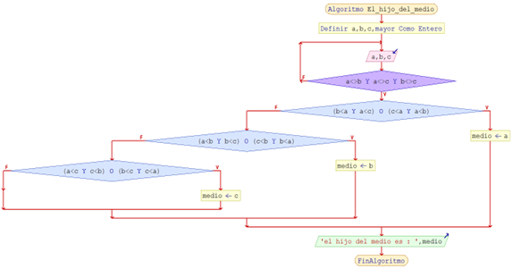

# 7.El hijo del medio
 
#### Dificultad: Intermedio

## Descripcion

*Se tienen tres números diferentes correspondientes a las edades de 3 hermanos de una familia chilena. Se debe determinar cuál es el hijo del medio.*


# Solución ADCP

# (A)NÁLISIS
###### Entradas:  3 números (a, b, c) distintos


###### Proceso mental: Esto se puede ver como un problema de intervalos: Solo basta con saber que entre tres números a, b, c con a!=b!=c, el del medio, corresponde al que esté entre dos números.

Escenarios posibles

escenario 1: b<a<c

escenario 2: c<a<b

escenario 3: a<b<c

escenario 4: c<b<c

escenario 5: a<c<b

escenario 6: b<c<a


###### Salida: Valor del hijo del medio 

###### Restricciones:edades distintas 


## DISEÑO 

## En  Pseudocódigo :
1.	Definir 3 variables a, b y c, 
2.	Leer cada una por teclado.
3.	Validar que sean distintas (si no lo son, volver a leer)
4.	Una vez leídas comprobar si cada variable se encuentra comprendida entre las dos restantes. 

## En Diagrama de 



# (C)odificación Py:
```py
    def main():
    a, b, c = 0, 0, 0
    
    while True:
        try:
            a, b, c = map(int, input("Edades de los 3 hermanos?(separados por un espacio):").split())
            
            if a > 0 and b > 0 and c > 0:
                break
            else:
                print("ERROR, Todas las edades deben ser no negativas y distintas de 0.")
        except ValueError:
            print("ERROR, entrada no valida. Ingrese numeros enteros.")
            
        if( b < a < c) or (c < a < b):
            medio=a
        else:
            if( a < b < c) or (c < b < a):
                medio=b
            else:
                if( a < c < b) or ( b< c < a):
                    medio = c
        print ("El hijo del medio es {}".format(medio))
        
        if __name__ == "__main__":
            main()
```
# (C)odificación C:
```c
    
```
# (P)ruebas (cambiando la ubicación del hijo del medio)
 
 |       Entradas 	    | Salida                 |
 
 |       a    b    c   |
 
 |----------------------|-------------------------|
 
 |      10    5    15    | el hijo del medio es 10|
 
 |      10    15   5     | el hijo del medio es 10|
 
 |      5     10   15    | el hijo del medio es 10|
 
 |      15    10   5     | el hijo del medio es 10|
 
 |      5     20   10    | el hijo del medio es 10|
 
 |      20    5    10    | el hijo del medio es 10|


