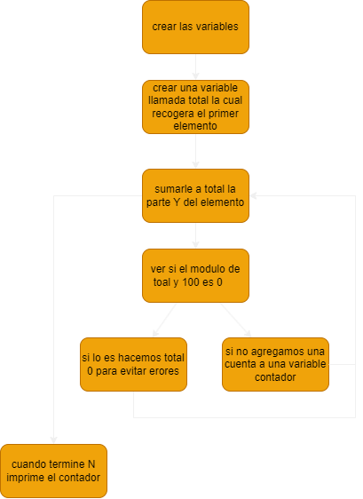

# origen 
[competencia](https://codeforces.com/gym/103185) letra N 

traducido e interpretado por Vicente Bastidas

# ejercicio

#### dificultad: facil 

## descripicion 

Deborah es una abogada muy importante con una cuenta bancaria muy importante. Como Deborah es tan buena abogada y tiene tantos clientes bajo su ala, ella deposita dinero en su cuenta bancaria cada dia.

Despues de ir al banco y depositar su dinero, Deborah se va a trabajar y en ese trayecto reside la debilidad de Deborah, una tienda de completos, veras, Deborah esta en reabilitacion con los completos y aunque ella no a comido completos en años, no puede evitar pensar en cuantos completos de 1 dolar podria comprar con el dinero en su cuenta si volviese a comer completos.

Teniendo 5 dolares en su cuenta equivalen a 5 completos que Deborah podria comprar ¿pero que ahi de 4.5 dolares? bueno eso es ciertamente mas de 4 donas de seguro, pero no son 5. ¿Como uno podria comprar comprar una cantidad no entera de donas? Ese  concepto confunde a Deborah, asi que cada vez que al revisar su cuenta esta no es un entero ella se detiene a pensar en la naturaleza de los completos no enteros y termina llegando atrasada al trabajo.

Ahora Deborah a llegado muchas veces atrasada al trabajo y esta empezando a preocuparse de perder su puesto. Ella quiere saber cuantas veces va a llegar tarde al trabajo durante N dias, dado su cantidad inicial de dinero en la cuetna y la cantidad de dinero que deposita cada dia, podrias ayudar a Deborah a ver cuantos dias se quedara pensando.

## Input
la primera linea contiene un entero N (1 <= N <=1000), representando la cantidad de dias que Deborah esta interesada, las siguientes N + 1 lineas contienen un string representando la cantidad de dinero que Deborah y las siguientes N lineas la cantidad de plata que agregara a la cuenta cada dia, cada string esta compuesto por dos substrings de la forma X.Y donde ambos son substrings de tamaño 1 o 2, X representando la parte entera del dinero en la cantidad X.Y e Y denota los centavos de la cantidad X.Y.

## Output
que entregue una sola linea con un entero indicando cuantas veces Debora llegara tarde a trabajar durante los N siguientes dias.

## ejemplo


# ADCP

## (A)nalisis


###### entradas
un entero N 
N strings con la forma $X.Y donde X e Y son numeros 

###### restricciones 

1 <= N <= 1000
X e Y son a lo mucho de 2 caracteres de largo

###### proceso
este ejercicio puede confundir un poco al principio, pero en realidad es bastante simple, todo lo que tenemos que hacer es ir replicando cuanto dinero ingresa a la cuenta, y por como funciona la peticion solo tenemos que ver si el valor decimal es distinto de 0 y eso irlo contando

<dibujo del proceso>

##### salida 
un entero  
## (D)iseño



## (C)odificacion

```py
N = int(input())
total = int(input().split(".")[1]) #volver el input en un numero 
contador  = 0
for i in range(N):
    total += int(input().split(".")[1])
    if (total%100 == 0):
        total = 0
    else:
        contador +=1
print(contador)
```

## (P)ruebas 